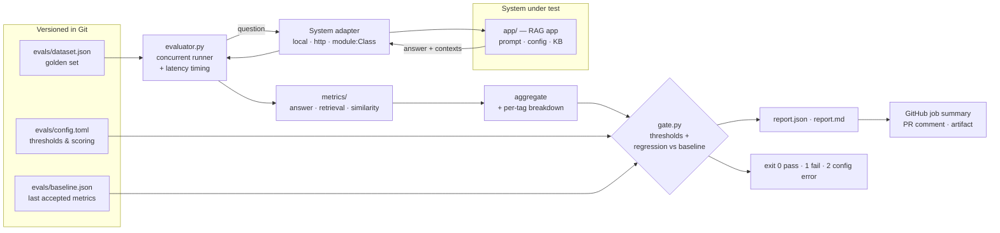

# rageval — Automated RAG / Agent Evaluation Pipeline

[](https://github.com/FlorianMartins/rag-eval-pipeline/actions/workflows/eval.yml)


**Treat the quality of an AI application like any other build artifact: measured on every change, compared with a baseline, and able to block a merge.**

`rageval` is a lightweight, open-source evaluation harness for RAG systems and agents. It runs a versioned golden dataset against the system under test, scores answers and retrieval with deterministic metrics, writes JSON + Markdown reports, and exits non-zero when quality drops — so it plugs into any CI/CD pipeline as a **quality gate**.

- **Zero-dependency harness**: the evaluator is standard library only. (The demo app's hybrid retrieval is an opt-in extra.)
- **Offline & deterministic by default**: same commit → same score. No flaky gate, no API bill per PR.
- **System-agnostic**: evaluate an in-process pipeline, a deployed HTTP service, or any `module:Class` adapter.
- **CI-native**: exit codes, GitHub job summary, sticky PR comment, report artifacts, nightly drift run.

---

## Why a single accuracy score is not a quality gate

The repository ships a small RAG assistant (`app/`) and a 24-case golden set. Here is what the pipeline reports when someone loosens the assistant's refusal guardrail (`make eval-hallucination`):

| Metric | Baseline | After the change | |
|---|---:|---:|---|
| Accuracy on answerable questions | 1.00 | 1.00 | unchanged: looks harmless |
| Overall accuracy | 1.00 | 0.917 | still well above the 0.80 floor |
| Faithfulness (groundedness) | 1.00 | 1.00 | unchanged: every sentence is copied from the docs |
| **Refusal accuracy (out-of-scope)** | 1.00 | **0.50** | ❌ **gate fails** |

The change leaves every in-scope answer intact and makes the assistant **confidently answer questions it should decline** ("Do you support Kubernetes?" → *"Support is available by email on every plan."*). The answer is even perfectly "faithful" — copied verbatim from the documentation — just not an answer. An accuracy floor would have merged it; the dedicated refusal metric names the actual problem. This is why the gate is a set of checks on **complementary** metrics, each targeting a different failure mode.

Each degraded configuration is caught — and not always by the check you would expect:

| Change | Failure mode | Caught by |
|---|---|---|
| `top_k=1` | retriever starved: multi-part questions lose context | **only** the regression check (accuracy 1.00 → 0.83, recall 1.00 → 0.90): still above every absolute floor |
| `min_coverage=0.2` | guardrail loosened: answers out-of-scope questions | `min_refusal_accuracy` (0.50), and the regression check (accuracy 1.00 → 0.92) |
| `min_coverage=0.8` | over-cautious: refuses answerable questions | `min_accuracy`, `min_answer_similarity` |

The first row is the lesson of improving a system: once it scores 1.00, an 0.80 floor no longer protects anything. The **baseline** is what holds the level you have reached.

Sample reports: [passing run](docs/sample-report-pass.md) · [failing run](docs/sample-report-fail.md).

---

## Architecture



The harness (`src/rageval`) and the application under test (`app/`) are deliberately separate packages: the harness knows nothing about the app except the adapter contract, so the same pipeline can evaluate a LangChain chain, a LlamaIndex engine, or an agent behind an API.

### Project structure

```
rag-eval-pipeline/
├── app/                        # THE SYSTEM UNDER TEST (replace with yours)
│   ├── rag_app.py              #   BM25 or hybrid retrieval + extractive or LLM generation
│   ├── embeddings.py           #   dense index + word-level grounding (model2vec)
│   ├── server.py               #   same app exposed over HTTP (/answer, /healthz)
│   ├── config.toml             #   top_k, refusal thresholds, generation mode
│   └── prompts/answer.txt      #   prompt template (LLM mode)
├── knowledge_base/             # documents the RAG app retrieves from
├── evals/                      # EVALUATION-AS-CODE, reviewed like code
│   ├── dataset.json            #   golden set (GATES merges): questions, ground truth, expected context, assertions
│   ├── challenge.json          #   challenge set (report-only): paraphrases & near-topic traps
│   ├── config.toml             #   quality-gate thresholds and scoring settings
│   └── baseline.json           #   metrics of the last accepted version (regression reference)
├── src/rageval/                # THE EVALUATION HARNESS
│   ├── dataset.py              #   schema, validation, content hash
│   ├── systems/                #   adapters: base contract, local, http
│   ├── metrics/                #   pure functions: answer, retrieval, similarity, text
│   ├── evaluator.py            #   runner: concurrency, timing, error isolation, aggregation
│   ├── gate.py                 #   thresholds + regression checks → pass/fail
│   ├── report.py               #   JSON + Markdown reports
│   └── cli.py                  #   `rageval run` / `rageval baseline`, exit-code contract
├── tests/                      # 54 tests: metrics, gate, runner, CLI end-to-end, HTTP, hybrid app
├── docs/                       # sample reports
├── .github/workflows/eval.yml  # CI: tests → quality gate → service gate
├── Dockerfile · Makefile · pyproject.toml
```

---

## Metrics

All metrics are pure functions in `src/rageval/metrics/`, unit-tested and deterministic.

| Metric | Question it answers | Implementation | Blind spot |
|---|---|---|---|
| **Accuracy** | Did the case pass? | All assertions pass, no unwanted refusal, and answer similarity ≥ `min_case_similarity` | Aggregates hide which *kind* of case failed → see refusal accuracy & per-tag table |
| **Assertions** | Does the answer contain the facts that matter? | `must_include` (with `a\|b` alternatives) / `must_not_include`, case- and accent-insensitive | Only as good as the assertions written |
| **Answer similarity** | How close is the answer to the ground truth? | `lexical` (default): mean of word-cosine and char-trigram cosine — robust to inflection. `embedding`: sentence-transformers cosine (`pip install '.[semantic]'`) | Lexical misses paraphrases → use `embedding` for LLM-generated answers |
| **Token F1** | SQuAD-style overlap | Token precision/recall vs ground truth | Penalises verbose but correct answers |
| **Context recall** | Did the retriever bring back *everything* needed? | Share of `expected_context` facts found in ≥ 1 retrieved chunk (≥ 80 % of the fact's content tokens) | Needs facts annotated in the dataset |
| **Context precision** | Is the signal at the *top* of what the LLM sees? | Rank-aware average precision over chunks containing a fact (RAGAS-style) | Treats a chunk as binary relevant/irrelevant |
| **Faithfulness** | Is the answer grounded in the retrieved context? | Share of answer content tokens present in the context — cheap hallucination proxy | Cannot see an answer that is *grounded but irrelevant* (hence refusal accuracy) |
| **Refusal accuracy** | Does it decline when the answer isn't in the KB? | Out-of-scope cases (`answerable: false`) must produce a refusal | Needs out-of-scope cases in the golden set |
| **Latency** | Is it fast enough? | Wall-clock per request; mean, p50, p95 (nearest-rank), max | Local runs aren't representative of production load |
| **Error rate** | Does it crash? | Exceptions are captured per case, never abort the suite | — |

---

## Quality gate

Thresholds live in [`evals/config.toml`](evals/config.toml) and are reviewed like code — raising one is a product decision, lowering one needs a justification in the PR.

```toml
[thresholds]                     # min_<metric> / max_<metric>, any key of report.json → metrics
min_accuracy = 0.80
min_refusal_accuracy = 1.0       # never hallucinate on out-of-scope questions
min_context_recall = 0.85
min_context_precision = 0.80
min_faithfulness = 0.90
min_answer_similarity = 0.60
max_latency_p95_ms = 500
max_error_rate = 0.0

[regression]
max_drop = 0.05                  # vs evals/baseline.json
```

Two layers:

1. **Absolute floors** — the level the product must never go below.
2. **Regression checks** against `evals/baseline.json` — catch slow drift that is still above the floor (0.95 → 0.86). The baseline is promoted explicitly with `make baseline`, which **refuses to promote a failing report**.

The gate **fails closed**: a threshold on a metric that could not be computed fails, an unknown metric name is a configuration error.

| Exit code | Meaning | CI behaviour |
|---|---|---|
| `0` | quality gate passed | merge allowed |
| `1` | quality gate failed | job red, PR blocked |
| `2` | configuration error (bad dataset, unknown system, invalid threshold) | job red — never a false green |

---

## Quickstart

Requires Python ≥ 3.11.

```bash
git clone https://github.com/FlorianMartins/rag-eval-pipeline.git
cd rag-eval-pipeline
make install            # venv + editable install (or: pip install -e '.[dev,embeddings]')
make eval               # run the golden set + quality gate  → reports/report.{json,md}
make test               # lint + 54 tests
```

See the gate fail on purpose:

```bash
make eval-degraded      # top_k=1          → exit 1 (regression vs baseline)
make eval-hallucination # min_coverage=0.2 → exit 1 (refusal accuracy)
make eval-challenge     # hard cases, report-only
```

Useful options:

```bash
rageval run --tag billing --tag security          # run a subset
rageval run --system-opt top_k=5                  # override the system's config
rageval run --baseline evals/baseline.json        # enable regression checks
rageval run --no-fail                             # report-only mode (exit 0)
rageval baseline reports/report.json              # promote a passing report to baseline
```

### Docker

```bash
make docker-eval
# or
docker build -t rageval .
mkdir -p reports
docker run --rm --user "$(id -u):$(id -g)" -v "$PWD/reports:/workspace/reports" rageval
docker run --rm rageval run --system-opt top_k=1   # any CLI arguments
```

The image runs as a non-root user (`--user` maps it to yours so the mounted `reports/` stays writable). The embedding model is baked in at its pinned revision, so the container evaluates **offline** (`--network none` is tested in CI).

### Against a running service

```bash
make serve              # terminal 1: app on http://127.0.0.1:8000/answer
make eval-http          # terminal 2: same suite over HTTP
```

This is how you would gate a **staging or preview deployment** before promoting it: point `--system http --system-opt url=...` at it (`RAG_API_TOKEN` is sent as a bearer token if set). Only `http(s)` URLs are accepted.

### With a real LLM

Set `generation.mode = "openai_compatible"` in `app/config.toml` and export `LLM_BASE_URL`, `LLM_MODEL`, `LLM_API_KEY`. Any OpenAI-compatible endpoint works (OpenAI, vLLM, Ollama, LiteLLM, …). Switch `similarity_backend` to `"embedding"` so paraphrased answers are scored fairly.

---

## Hybrid retrieval: fixing failures without buying hallucinations

The first version (BM25 only) failed two golden cases on vocabulary mismatch: the docs say *"annually"* and *"encrypted"*, the questions said *"annual"* and *"encryption"*. Retrieval was fine (context recall 1.0); the **refusal guard** decided the question was not answered and declined.

`retrieval.mode = "hybrid"` adds [model2vec](https://github.com/MinishLab/model2vec) static embeddings (`potion-base-8M`, ~30 MB, numpy only, pinned revision) in two places:

1. **Retrieval** — BM25 and dense rankings merged with Reciprocal Rank Fusion.
2. **Grounding** — the refusal guard asks what share of the question (IDF-weighted) is *grounded* in the answer chunk. A word now counts as grounded if it appears there **or** has an embedding neighbour there (*yearly ≈ annually* 0.85, *trashed ≈ trash* 0.91, *monthly ≈ month* 0.83).

The obvious alternative — answer when the question is *semantically close* to a chunk — was measured and rejected: *"What is the API rate limit for the **free tier**?"* scores 0.72 against the rate-limit chunk, higher than most legitimate questions, yet there is no free tier. **Topical similarity is not answerability.** Word-level grounding keeps *free*, *student*, *employees*, *premium* ungrounded (0.07–0.29), so those questions are still refused.

Measured with the pipeline itself:

| | Golden set (gate) | Challenge: paraphrases answered | Challenge: traps refused |
|---|---:|---:|---:|
| BM25 (v0.1) | 22/24 | — | — |
| BM25 + tokenizer fix | 23/24 | 1/11 | 9/9 |
| Hybrid, sentence similarity *(rejected)* | 24/24 | 6/11 | 6/9 — answers *student discount*, *free tier*, *employees* |
| **Hybrid, word grounding (shipped)** | **24/24** | **4/11** | **9/9** |

Attribution matters: one of the two fixes (`encryption-at-rest`) actually came from a tokenizer change ("used" is now a stopword), not from the embeddings — the table separates them.

**The challenge set** (`evals/challenge.json`) holds hard cases written *after* the thresholds were chosen, so they cannot have been tuned on. It runs in CI in report-only mode (`--no-fail`): it tracks progress on unsolved problems without blocking merges. A case graduates to the golden set once the system handles it reliably. The 7 paraphrases still missed (*ciphers* → TLS, *servers* → regions, *identity provider* → SSO) need more than word-level similarity — see the roadmap.

## Evaluating your own system

Implement two methods — `query()` and `describe()`:

```python
# my_project/eval_adapter.py
from rageval.systems import Context, SystemResponse
from my_project.chain import build_chain


class MyRAG:
    def __init__(self, model: str = "default"):
        self.chain = build_chain(model)

    def query(self, question: str) -> SystemResponse:
        out = self.chain.invoke({"question": question})
        return SystemResponse(
            answer=out["answer"],
            contexts=tuple(Context(text=d.page_content, source=d.metadata["source"]) for d in out["docs"]),
        )

    def describe(self) -> dict:
        return {"type": "my-rag", "model": self.chain.model_name}
```

```bash
rageval run --system my_project.eval_adapter:MyRAG --system-opt model=large
```

### Dataset format

```jsonc
{
  "name": "northwind-support-golden",
  "version": "1.1.0",
  "cases": [
    {
      "id": "api-rate-limit-exceeded",
      "question": "What HTTP status code is returned when the rate limit is exceeded?",
      "ground_truth": "The API returns HTTP status 429 with a Retry-After header.",
      "expected_context": ["When the rate limit is exceeded the API returns HTTP status 429"],
      "assertions": { "must_include": ["429"], "must_not_include": ["500"] },
      "tags": ["api"]
    },
    { "id": "oos-kubernetes", "question": "Do you support Kubernetes?", "answerable": false, "tags": ["out-of-scope"] }
  ]
}
```

The loader validates the file and fails with exit code 2 on missing fields, duplicate ids or an empty set. Every report records the dataset's **SHA-256**, so a score is always traceable to the exact golden set that produced it.

---

## CI/CD integration

[`.github/workflows/eval.yml`](.github/workflows/eval.yml) runs on every change that can alter the assistant's behaviour: code, **prompts**, **retrieval config**, **knowledge base**, harness or golden set, plus a **nightly schedule**.

```
┌────────────────────┐     ┌─────────────────────────────┐
│ test (3.11–3.13)   │ ──▶ │ evaluate (quality gate)     │ ─▶ job summary · sticky PR comment · artifact
│ ruff + pytest      │     │ rageval run --baseline ...  │ ─▶ exit 1 blocks the merge
└────────────────────┘     └─────────────────────────────┘
          │                ┌─────────────────────────────┐
          └──────────────▶ │ evaluate-service            │   same suite against the app running over HTTP
                           └─────────────────────────────┘
```

Design points:

- **The harness is tested before its verdict is trusted** — the gate job `needs: test`. The harness tests run against a *pinned* copy of the app config (`tests/fixtures/`), so tuning the app never breaks them: judging the live app is the gate's job alone.
- **Report first, fail last**: the eval step records the exit code, the report is uploaded and commented, and only then does the final step fail the job — a red build always comes with its explanation.
- **Sticky PR comment** (updated in place, not one per push); skipped on fork PRs whose token is read-only, where the job summary still shows the report.
- **Least privilege**: `contents: read` globally, `pull-requests: write` only on the job that comments. LLM credentials come from repository secrets/variables and are only needed in LLM mode.
- **Nightly run** catches drift that no commit caused: a hosted model update, an API change, a knowledge-base sync.

To make it a hard merge requirement, mark **Quality gate** as a required status check in the branch protection rules.

---

## How this maps to MLOps / LLMOps practice

| Practice | In this repo |
|---|---|
| Evaluation-as-code | Golden set, thresholds and baseline are versioned files, changed through PRs |
| Reproducibility | Deterministic default mode; reports record commit SHA, dataset hash, system config, harness version |
| Continuous evaluation | Runs on every behaviour-changing PR + nightly for drift |
| Regression testing | Explicit baseline promotion; per-metric drop budget |
| Shift-left on hallucinations | Out-of-scope cases with a dedicated, non-negotiable threshold |
| Environment parity | Same suite in-process, over HTTP, and in Docker |
| Observability hooks | `report.json` is a stable, machine-readable schema — ready to push to a dashboard or experiment tracker for trend lines |

---

## Design decisions

- **Deterministic metrics in the gate, LLM-as-judge outside it.** An LLM judge captures semantics better, but it is non-deterministic, costs money per PR and can itself regress. The gate should be cheap and stable; an LLM judge fits the nightly run or a pre-release review.
- **Zero-dependency harness, optional app extras.** The harness is often the first thing added to a pipeline; it should not bring a supply-chain review with it. The demo app's embeddings (`[embeddings]`) and embedding-based answer scoring (`[semantic]`) are opt-in.
- **Harness tests are pinned to a BM25 config** (`tests/fixtures/`): they test the harness, not the app, so tuning the app never breaks them, and they need no model download.
- **Pinned model revision.** An embedding model updated upstream changes scores silently; pinning makes it a reviewed diff in `app/config.toml` (and keys the CI cache).
- **The demo app is deliberately simple** (extractive answers, a 30 MB static-embedding model) so the whole pipeline runs offline in seconds and the failure modes are explainable. It is a stand-in: swap it for your system via an adapter.
- **Thresholds are chosen on the golden set and checked on the challenge set.** The tightest golden case (`security-encryption-at-rest`) grounds at 0.51 against a 0.50 threshold: deterministic thanks to the pinned model, but documented rather than hidden.

## Limitations & roadmap

- **Sample size.** With 24 cases one case is ≈ 4 points of accuracy, so `max_drop = 0.05` tolerates about one flipped case. Grow the golden set (and report bootstrap confidence intervals) before tightening thresholds.
- **Non-deterministic systems.** For LLM mode at temperature > 0: repeat each case *n* times and gate on the mean / pass@k.
- **Query rewriting / a cross-encoder reranker** for the 7 challenge paraphrases that word-level similarity cannot bridge (*ciphers* → TLS, *identity provider* → SSO), keeping traps at 9/9.
- **LLM-as-judge** backend for faithfulness and correctness, with judge-agreement tracking against human labels.
- **Cost tracking** (tokens per case) as a gated metric alongside latency.
- **Agent evaluation**: tool-call assertions (expected tool, arguments) and trajectory checks for multi-step agents.

## License

MIT — see [LICENSE](LICENSE).
